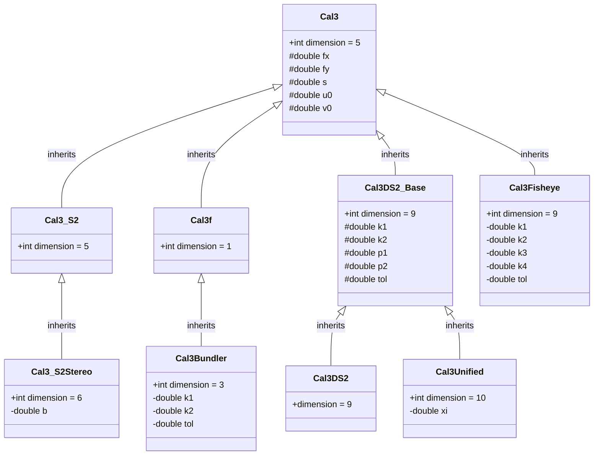
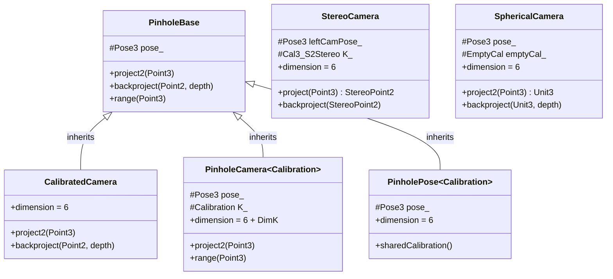

# Geometry

The `geometry` module provides the core classes for geometric concepts in GTSAM. This includes fundamental types such as Lie groups for rotations and poses, classes for 2D and 3D points, and various camera models for calibration. These representations are essential building blocks for many algorithms in the library, especially for inference and SLAM applications.

## Core Types

This section describes the fundamental geometric types that serve as building blocks for GTSAM's optimization and inference algorithms.

### Basic Geometric Primitives

#### Points
- [Point2](https://github.com/borglab/gtsam/blob/develop/gtsam/geometry/Point2.h): 2D Euclidean points with basic arithmetic operations
- [Point3](https://github.com/borglab/gtsam/blob/develop/gtsam/geometry/Point3.h): 3D Euclidean points with full vector space operations

#### Directional Vectors
- [Unit3](https://github.com/borglab/gtsam/blob/develop/gtsam/geometry/Unit3.h): Unit-length direction vectors in 3D space, parameterized on the 2-sphere manifold. Essential for bearing measurements and representing directions without magnitude.

### Rotation Groups

#### Basic Rotations
- [Rot2](doc/Rot2.ipynb): 2D rotation group SO(2) using angle parameterization
- [Rot3](doc/Rot3.ipynb): 3D rotation group SO(3) with multiple representations (rotation matrices, quaternions, axis-angle)

#### General Special Orthogonal Groups
- [SO3](doc/SO3.ipynb): Alternative implementation of 3D rotations with explicit SO(3) structure
- [SO4](https://github.com/borglab/gtsam/blob/develop/gtsam/geometry/SO4.h): 4D special orthogonal group SO(4), useful for dual quaternions and 4D rotational symmetries
- [SOn](https://github.com/borglab/gtsam/blob/develop/gtsam/geometry/SOn.h): General n-dimensional special orthogonal group implementation for higher-dimensional rotation spaces

#### Quaternion Support
- [Quaternion](https://github.com/borglab/gtsam/blob/develop/gtsam/geometry/Quaternion.h): Quaternion representation wrapper providing efficient rotation operations and interpolation

### Pose Groups

#### Rigid Body Poses
- [Pose2](doc/Pose2.ipynb): 2D rigid body transformations SE(2) combining 2D rotation and translation
- [Pose3](doc/Pose3.ipynb): 3D rigid body transformations SE(3) combining 3D rotation and translation

#### Extended Transformation Groups
- [Similarity2](https://github.com/borglab/gtsam/blob/develop/gtsam/geometry/Similarity2.h): 2D similarity transformations Sim(2) adding uniform scaling to SE(2)
- [Similarity3](https://github.com/borglab/gtsam/blob/develop/gtsam/geometry/Similarity3.h): 3D similarity transformations Sim(3) adding uniform scaling to SE(3)

### Advanced Groups

#### Galilean Transformations
- [Gal3](https://github.com/borglab/gtsam/blob/develop/gtsam/geometry/Gal3.h): 3D Galilean group for non-relativistic spacetime transformations, combining spatial rotations, translations, and velocity boosts. Useful for classical mechanics and inertial navigation systems.

**Key Features of Gal3:**
- 9 degrees of freedom: 3D rotation, 3D translation, 3D velocity
- Represents transformations between inertial reference frames
- Applications in INS/GPS integration and vehicle dynamics
- Proper handling of acceleration and velocity transformations

### Manifold Properties

All core types implement the GTSAM manifold concept, providing:
- **Retract**: Maps tangent space increments back to the manifold
- **LocalCoordinates**: Maps manifold points to tangent space
- **Dimension**: Compile-time or runtime manifold dimensionality
- **Jacobian support**: Automatic differentiation for optimization

These fundamental types form the mathematical foundation for factor graphs, enabling precise geometric computations with proper uncertainty propagation throughout GTSAM's algorithms.

## Calibration Models
This section describes the classes representing different camera calibration models in GTSAM. These models handle the conversion between a camera's 3D coordinate system and the 2D image plane, accounting for intrinsic parameters like focal length, principal point, and lens distortion.

The models are organized in a class hierarchy, with more specialized models inheriting from base classes.

### Cal3
[Cal3](https://github.com/borglab/gtsam/blob/develop/gtsam/geometry/Cal3.h) is the common base class for all calibration models. It stores the five standard intrinsic parameters:
- `fx`, `fy`: Focal length in x and y.
- `s`: Skew factor.
- `u0`, `v0`: Principal point (image center).

It provides the basic functionality but is not intended to be used directly in optimization, as it does not define a manifold structure itself.

### Cal3_S2
[Cal3_S2](doc/Cal3_S2.ipynb) is the most common 5-degree-of-freedom (DOF) calibration model and is designed for use in optimization. It represents the five parameters of Cal3 on a 5-dimensional manifold, allowing it to be used directly in factor graphs.

### Cal3_S2Stereo

[Cal3_S2Stereo](https://github.com/borglab/gtsam/blob/develop/gtsam/geometry/Cal3_S2Stereo.h) extends `Cal3_S2` for use with stereo cameras. It inherits the five standard intrinsic parameters and adds a sixth parameter, `b`, for the stereo baseline. This results in a 6-dimensional manifold for optimization.

### Cal3f

[Cal3f](https://github.com/borglab/gtsam/blob/develop/gtsam/geometry/Cal3f.h) is a special, simplified model that assumes zero skew and a single focal length $f$ (i.e., $f_x = f_y$). The principal point $(u_0, v_0)$ is also considered a fixed constant and is not optimized.

Because only the focal length $f$ is a variable, `Cal3f` has a manifold dimension of 1. This makes it extremely efficient for scenarios where you only need to calibrate for focal length, as the optimization space is much smaller.

### Cal3Bundler

[Cal3Bundler](https://github.com/borglab/gtsam/blob/develop/gtsam/geometry/Cal3Bundler.h) is designed to be compatible with Bundler, a structure-from-motion (SfM) system for unordered image collections written in C and C++. It inherits from `Cal3f` and adds two radial distortion coefficients, `k1` and `k2`. This gives it a total of 3 degrees of freedom for optimization.

### Cal3Fisheye

[Cal3Fisheye](https://github.com/borglab/gtsam/blob/develop/gtsam/geometry/Cal3Fisheye.h) is designed for cameras with fisheye lenses and implements the distortion model used by OpenCV. It inherits from the base `Cal3` class and adds four fisheye-specific distortion coefficients: `k1`, `k2`, `k3`, and `k4`. This results in a 9-dimensional manifold for optimization.

### Cal3DS2_Base, Cal3DS2, and Cal3Unified

This group of classes handles standard radial and tangential lens distortion, as specified by OpenCV.

- [Cal3DS2_Base](https://github.com/borglab/gtsam/blob/develop/gtsam/geometry/Cal3DS2_Base.h): This is a base class that adds four distortion parameters (`k1`, `k2` for radial and `p1`, `p2` for tangential) to the five standard parameters from `Cal3`, for a total of 9 parameters.
- [Cal3DS2](https://github.com/borglab/gtsam/blob/develop/gtsam/geometry/Cal3DS2.h): This class inherits from `Cal3DS2_Base` and implements the necessary manifold structure, making the 9-DOF model usable for optimization.
- [Cal3Unified](https://github.com/borglab/gtsam/blob/develop/gtsam/geometry/Cal3Unified.h): This model is for omni-directional cameras and extends `Cal3DS2_Base` by adding a mirror parameter `xi`. This brings the total number of parameters to 10, creating a 10-dimensional manifold for optimization.

## Camera Models

This section describes the classes representing different camera models in GTSAM. These models combine poses with calibration information to enable 3D-to-2D projection operations essential for computer vision and SLAM applications.

### CalibratedCamera

[CalibratedCamera](https://github.com/borglab/gtsam/blob/develop/gtsam/geometry/CalibratedCamera.h) is a calibrated camera class with fixed calibration matrix K = I (identity). This class assumes the intrinsic camera parameters are known and normalized, making it computationally efficient when the calibration is pre-known.

**Key Features:**
- 6 degrees of freedom (pose only)
- Fixed calibration matrix (identity)
- Ideal when measurements are pre-calibrated
- More efficient than full pinhole cameras when calibration is known

### PinholeCamera

[PinholeCamera](https://github.com/borglab/gtsam/blob/develop/gtsam/geometry/PinholeCamera.h) is a templated class that combines a 3D pose with any calibration model. This is the most general pinhole camera implementation and allows optimization of both camera pose and intrinsic parameters.

**Key Features:**
- Templated on calibration type (Cal3_S2, Cal3Bundler, etc.)
- Dimension depends on calibration: 6 + calibration DOF
- Suitable when both pose and calibration need optimization
- Provides full projection and back-projection capabilities

**Common instantiations:**
- `PinholeCameraCal3_S2`: Standard 5-DOF calibration
- `PinholeCameraCal3Bundler`: 3-DOF Bundler-compatible calibration
- `PinholeCameraCal3DS2`: 9-DOF with radial/tangential distortion
- `PinholeCameraCal3Unified`: 10-DOF for omni-directional cameras
- `PinholeCameraCal3Fisheye`: 9-DOF for fisheye lenses

### PinholePose

[PinholePose](doc/PinholePose.ipynb) separates pose from calibration by storing a fixed calibration as a shared pointer. This design is optimal when the calibration is known and only the pose varies across different camera instances.

**Key Features:**
- 6 degrees of freedom (pose only)
- Shared calibration stored separately
- Efficient for multi-view scenarios with fixed calibration
- Reduced memory footprint when many cameras share calibration

### StereoCamera

[StereoCamera](https://github.com/borglab/gtsam/blob/develop/gtsam/geometry/StereoCamera.h) models a rectified stereo camera system. It represents the left camera pose and includes stereo-specific calibration parameters like baseline.

**Key Features:**
- 6 degrees of freedom (left camera pose)
- Uses Cal3_S2Stereo for stereo-specific calibration
- Projects 3D points to StereoPoint2 (uL, uR, v)
- Supports stereo triangulation and depth estimation

### SphericalCamera

[SphericalCamera](https://github.com/borglab/gtsam/blob/develop/gtsam/geometry/SphericalCamera.h) represents a camera with spherical projection model. Instead of projecting to image coordinates, it measures bearing vectors as Unit3 directions.

**Key Features:**
- 6 degrees of freedom (pose only)
- Projects to Unit3 bearing directions instead of pixel coordinates
- No cheirality exceptions (can see behind camera)
- Useful for omnidirectional cameras and bearing-only measurements
- Empty calibration (EmptyCal) as no intrinsics are needed

### SimpleCamera

[SimpleCamera](https://github.com/borglab/gtsam/blob/develop/gtsam/geometry/SimpleCamera.h) provides convenient type aliases for commonly used camera configurations. It doesn't define new classes but creates readable aliases for PinholeCamera and PinholePose with specific calibrations.

**Type Aliases:**
- `PinholePoseCal3_S2`, `PinholePoseCal3Bundler`, etc.
- `PinholeCameraCal3_S2`, `PinholeCameraCal3Bundler`, etc.

### Camera Utilities

**Associated Measurement Types:**
- [StereoPoint2](https://github.com/borglab/gtsam/blob/develop/gtsam/geometry/StereoPoint2.h): Stereo measurement (uL, uR, v) for stereo cameras

**Camera Collections:**
- [PinholeSet](https://github.com/borglab/gtsam/blob/develop/gtsam/geometry/PinholeSet.h): Utilities for working with sets of pinhole cameras
- [CameraSet](https://github.com/borglab/gtsam/blob/develop/gtsam/geometry/CameraSet.h): Generic camera set utilities for multi-view operations

## Geometric Relations and Utilities

This section covers additional geometric entities and utilities that support computer vision and SLAM applications beyond basic poses and cameras.

### 3D Geometric Primitives

#### Line3
[Line3](https://github.com/borglab/gtsam/blob/develop/gtsam/geometry/Line3.h) represents 3D lines using a 4-dimensional manifold parameterization (R, a, b), where R is a rotation about the x and y axes, and (a, b) define the intersection with the rotated xy-plane.

**Key Features:**
- 4 degrees of freedom manifold representation
- Efficient line-to-image projection for line-based SLAM
- Support for line transformation between coordinate frames
- Robust parameterization avoiding singularities

#### OrientedPlane3
[OrientedPlane3](https://github.com/borglab/gtsam/blob/develop/gtsam/geometry/OrientedPlane3.h) represents oriented planes in 3D space using unit normal vectors and distance from origin.

**Key Features:**
- Minimal 3-DOF representation using Unit3 normal and distance
- Useful for plane-based SLAM and structure representation
- Support for point-to-plane distance calculations
- Manifold structure for optimization

### Two-View Geometry

#### EssentialMatrix
[EssentialMatrix](https://github.com/borglab/gtsam/blob/develop/gtsam/geometry/EssentialMatrix.h) encodes the essential matrix constraint for calibrated stereo cameras. It represents the epipolar geometry between two views with known intrinsic parameters.

**Key Features:**
- 5 degrees of freedom (3 for rotation, 2 for translation direction)
- Direct relationship to relative camera poses
- Used in calibrated stereo vision and visual odometry
- Supports epipolar constraint evaluation

#### FundamentalMatrix
[FundamentalMatrix](https://github.com/borglab/gtsam/blob/develop/gtsam/geometry/FundamentalMatrix.h) represents the fundamental matrix for uncalibrated stereo cameras, encoding epipolar geometry when intrinsic parameters are unknown.

**Key Features:**
- 7 degrees of freedom representation
- Works with uncalibrated image correspondences
- Useful for structure-from-motion applications
- Algebraic minimal representation avoiding rank-2 constraint

### Measurement Types and Utilities

#### BearingRange
[BearingRange](https://github.com/borglab/gtsam/blob/develop/gtsam/geometry/BearingRange.h) combines bearing (Unit3) and range (double) measurements, commonly used in radar, sonar, and bearing-only SLAM.

**Key Features:**
- Combines directional and distance information
- Useful for sensors providing both bearing and range
- Support for conversion to/from Cartesian coordinates
- Efficient for range-bearing factor graphs

#### StereoPoint2
[StereoPoint2](https://github.com/borglab/gtsam/blob/develop/gtsam/geometry/StereoPoint2.h) represents stereo measurements with left pixel coordinate (uL), right pixel coordinate (uR), and vertical coordinate (v).

**Key Features:**
- 3-element measurement: (uL, uR, v)
- Direct support for stereo triangulation
- Efficient storage for rectified stereo systems
- Built-in disparity calculations

### Vision and Triangulation Utilities

#### Triangulation
[triangulation](https://github.com/borglab/gtsam/blob/develop/gtsam/geometry/triangulation.h) provides utilities for triangulating 3D points from multiple 2D observations across different camera views.

**Key Features:**
- Linear and nonlinear triangulation methods
- Support for various camera models
- Robust outlier handling
- Optimal triangulation with uncertainty quantification

#### Event
[Event](https://github.com/borglab/gtsam/blob/develop/gtsam/geometry/Event.h) represents space-time events, useful for applications involving time-synchronized measurements or event-based cameras.

**Key Features:**
- Combines spatial Point3 and temporal information
- Useful for trajectory estimation with time constraints
- Support for event-based vision algorithms
- Space-time manifold operations

### Cyclic Groups

#### Cyclic
[Cyclic](https://github.com/borglab/gtsam/blob/develop/gtsam/geometry/Cyclic.h) provides utilities for working with cyclic groups and angular measurements, handling wraparound behavior for periodic quantities.

**Key Features:**
- Proper handling of angular wraparound
- Useful for compass bearings and angular sensors
- Manifold operations respecting cyclic nature
- Support for angular interpolation and averaging

### Collections and Sets

#### Camera Sets
- [PinholeSet](https://github.com/borglab/gtsam/blob/develop/gtsam/geometry/PinholeSet.h): Utilities for managing collections of pinhole cameras
- [CameraSet](https://github.com/borglab/gtsam/blob/develop/gtsam/geometry/CameraSet.h): Generic camera collection utilities

**Key Features:**
- Efficient multi-view operations
- Batch projection and back-projection
- Support for camera calibration workflows
- Memory-efficient storage for large camera sets

These geometric primitives and utilities provide the foundation for constructing sophisticated factor graphs and performing advanced computations in GTSAM's SLAM and computer vision applications.

## Usage Guidelines

### Choosing the Right Geometric Types

**For Basic SLAM Applications:**
- Use `Pose3` and `Point3` for 3D mapping and localization
- Use `Pose2` and `Point2` for 2D applications like mobile robotics
- Use `Rot3` when dealing with orientation-only problems

**For Computer Vision:**
- Use `PinholeCamera<Cal3_S2>` for standard camera applications
- Use `CalibratedCamera` when camera calibration is pre-known and fixed
- Use `StereoCamera` for stereo vision systems
- Use `SphericalCamera` for omnidirectional or bearing-only measurements

**For Advanced Applications:**
- Use `Similarity3` when scale is unknown (monocular SLAM, SfM)
- Use `Unit3` for bearing-only measurements and directional sensors
- Use `Line3` and `OrientedPlane3` for structure-based SLAM
- Use `Gal3` for inertial navigation and vehicle dynamics

**Performance Considerations:**
- `PinholePose` is more memory-efficient than `PinholeCamera` when calibration is shared
- `CalibratedCamera` is computationally faster when calibration is known
- `Cal3f` provides minimal overhead for applications with simple calibration requirements

### Integration with Factor Graphs

All geometry types in this module are designed to work seamlessly with GTSAM's factor graph framework:

1. **Manifold Interface**: All types provide proper manifold operations for optimization
2. **Jacobian Support**: Automatic differentiation enables efficient gradient-based optimization  
3. **Serialization**: Built-in support for saving and loading geometric states
4. **Thread Safety**: Most operations are thread-safe for parallel processing

### Best Practices

- Always use the minimal representation that captures your problem constraints
- Consider numerical stability when choosing between different rotation representations
- Use shared calibration objects (`PinholePose`) when multiple cameras have identical intrinsics
- Leverage the type system to catch geometric inconsistencies at compile time
- Profile performance for large-scale applications and choose representations accordingly

This comprehensive geometry module provides the mathematical foundation for robust and efficient SLAM, computer vision, and robotics applications within the GTSAM framework.
